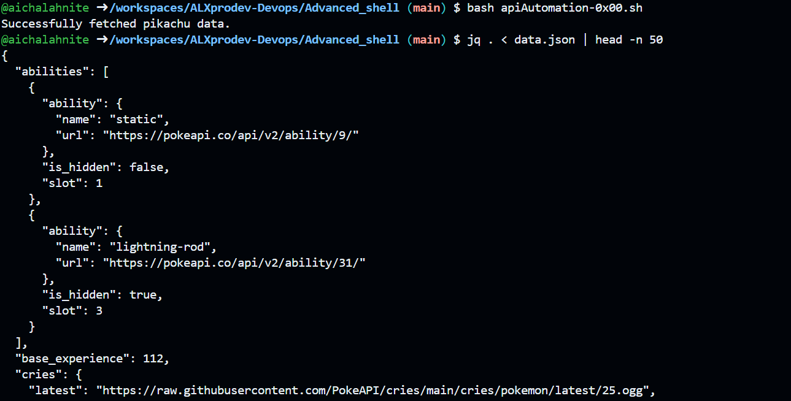

# Advanced Shell Scripting: Pokémon API Automation

## Project Overview

This project is a practical deep dive into **Advanced Shell Scripting**, focusing on automating interactions with the **Pokémon RESTful API**. It simulates real-world DevOps and Data Engineering workflows, covering:

* **API interaction** using `curl`
* **JSON parsing** with `jq`
* **Text processing** using `awk` and `sed`
* **Error handling and retries**
* **Parallel data fetching**
* **Data aggregation and reporting**

The final pipeline extracts Pokémon data, transforms it into a readable format, and generates summary reports.

---

## Directory Structure

```
Advanced_shell/
├── apiAutomation-0x00.sh          # Task 0: API request automation
├── data_extraction_automation-0x01.sh # Task 1: Extract Pokémon data
├── batchProcessing-0x02.sh        # Task 2 & 4: Batch retrieval + retry logic
├── summaryData-0x03.sh            # Task 3: Summarize Pokémon data
├── batchProcessing-0x04.sh        # Task 5: Parallel data fetching
├── pokemon_data/                   # Directory for individual Pokémon JSON files
├── pokemon_report.csv              # Task 3: CSV summary report
├── errors.txt                      # Logs failed API requests
└── README.md
```

---

## Prerequisites

* **Linux/macOS environment**
* **Bash shell**
* **Tools installed**:

  * `curl` (for HTTP requests)
  * `jq` (for JSON parsing)
  * `awk` (for text processing)
  * `sed` (for text manipulation)

---

## Scripts

### **1. API Request Automation**

* **File:** `apiAutomation-0x00.sh`
* **Description:** Fetches data for Pikachu and saves it as `data.json`. Logs errors to `errors.txt` if the request fails.
* **Usage:**

```bash
bash apiAutomation-0x00.sh
```

---

### **2. Extract Pokémon Data**

* **File:** `data_extraction_automation-0x01.sh`
* **Description:** Parses `data.json` to extract name, type, weight, and height, formatting it in a human-readable sentence.
* **Example Output:**

```
Pikachu is of type Electric, weighs 6kg, and is 0.4m tall.
```

* **Usage:**

```bash
bash data_extraction_automation-0x01.sh
```

---

### **3. Batch Pokémon Data Retrieval**

* **File:** `batchProcessing-0x02.sh`
* **Description:** Retrieves data for multiple Pokémon, handles rate limiting, and saves each to `pokemon_data/<name>.json`.
* **Enhanced Version:** Includes **retry logic** for up to 3 attempts on failure.
* **Usage:**

```bash
bash batchProcessing-0x02.sh
```

---

### **4. Summarize Pokémon Data**

* **File:** `summaryData-0x03.sh`
* **Description:** Reads all JSON files in `pokemon_data/`, generates a CSV report `pokemon_report.csv`, and calculates **average height and weight**.
* **Usage:**

```bash
bash summaryData-0x03.sh
```

* **Sample Output:**

```
CSV Report generated at: pokemon_report.csv

Name,Height (m),Weight (kg)
Bulbasaur,0.7,6.9
Charmander,0.6,8.5
Charmeleon,1.1,19.0
Ivysaur,1.0,13.0
Venusaur,2.0,100.0

Average Height: 1.08 m
Average Weight: 29.48 kg
```

---

### **5. Parallel Data Fetching**

* **File:** `batchProcessing-0x04.sh`
* **Description:** Fetches Pokémon data in parallel using background processes, speeding up data retrieval. Handles errors gracefully.
* **Usage:**

```bash
bash batchProcessing-0x04.sh
```

---

## Key Features

* **Error Handling & Retry Logic:** Ensures reliable API interactions.
* **Parallelism:** Efficiently fetches multiple Pokémon concurrently.
* **JSON Parsing & Reporting:** Converts API data into structured CSV reports.
* **Modular Scripts:** Each task is separate and reusable.

---

## How to Run the Full Pipeline

1. Fetch Pikachu data:

```bash
bash apiAutomation-0x00.sh
```

2. Extract Pikachu data:

```bash
bash data_extraction_automation-0x01.sh
```

3. Fetch multiple Pokémon (with retry logic):

```bash
bash batchProcessing-0x02.sh
```

4. Optionally fetch in parallel (faster):

```bash
bash batchProcessing-0x04.sh
```

5. Generate CSV summary:

```bash
bash summaryData-0x03.sh
```

---

## Author

**Aicha Lahnite** – ALX ProDev Backend Project – Advanced Shell Scripting (2025)
